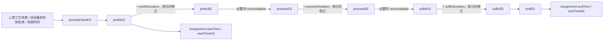
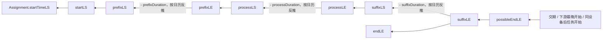
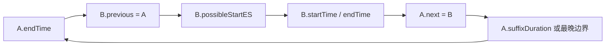

# Assignment 时间计算与循环依赖排查指南

> 适用模型：`ASJW-京卫作业排程`  
> 分析对象：`Assignment`、`EarliestAssignment`、`LatestAssignment`  
> 整理日期：2026-07-23  
> 说明：本文基于模型设计器中当前可见的属性、自动计算方法、调用链和方法实现整理。模型后续变更时，应以当前版本源码为准。

## 1. 先建立统一的时间轴

一个 Assignment 的完整占用区间分为三段：

```text
startTime
  │
  ├── prefixStartTime ── prefixDuration ── prefixEndTime
  │
  ├── processStartTime ─ processDuration ─ processEndTime
  │
  └── suffixStartTime ── suffixDuration ── suffixEndTime
                                                    │
                                                  endTime
```

含义如下：

| 时间 | 含义 | 主要来源 |
|---|---|---|
| `prefixStartTime` | 前处理开始 | ASAP 取 `earliestAssignment.prefixES`；JIT 取 `latestAssignment.prefixLS` |
| `prefixEndTime` | 前处理结束 | 前处理开始加前处理时长，并按设备日历修正 |
| `processStartTime` | 正式生产开始 | 通常接在前处理结束之后，并按设备可用时间修正 |
| `processEndTime` | 正式生产结束 | 生产开始加生产时长，并按设备日历修正 |
| `suffixStartTime` | 后处理开始 | 通常接在生产结束之后，并按设备可用时间修正 |
| `suffixEndTime` | 后处理结束 | 后处理开始加后处理时长，并按设备日历修正 |
| `startTime` | Assignment 总开始 | 当前实现首先取 `prefixStartTime`，部分工序有特殊修正 |
| `endTime` | Assignment 总结束 | 通常取最早/最晚边界的总结束时间，部分工序有特殊修正 |
| `duration` | Assignment 总时长 | `TimeCalc.durationBetween(startTime, endTime)` |

## 2. 模式选择：ASAP 与 JIT

`Assignment.asapMode` 决定采用哪条计算链。

### 2.1 ASAP：从左向右正推

ASAP 的目标是“在所有约束满足的情况下尽早开始”。



主链的已核对实现如下：

1. `Assignment.startTimeES = earliestAssignment.startES`
2. `EarliestAssignment.startES = prefixES`
3. `EarliestAssignment.prefixES`
   - 如果 `forceDragFlag=true`，直接使用 `forceStartTime`。
   - 否则从 `possibleStartES` 起算。
   - 如果时间落入“订单产能占用”等不可用区间，则移动到占用结束。
   - 根据设备的 `prefix/process/suffix CanBeFit` 和 `CanBeSplit` 配置，调用：
     - `resource.nextAvailable(...)`
     - `resource.calcStartForNotSplitByStartPlusDuration(...)`
   - 特定上下游车间场景还会与上一工序 `endTime` 取最大值。
4. `prefixEE = timePlusDuration(prefixES, prefixDuration)`
   - 前处理不可利用停机但可跨停机时，使用 `resource.nextFit(...)`。
5. `processES = prefixEE`
   - 生产不可利用停机时，使用 `resource.nextAvailable(prefixEE)`。
6. `processEE = timePlusDuration(processES, processDuration)`
   - 生产不可利用停机但可跨停机时，使用 `resource.nextFit(...)`。
7. `suffixES = processEE`
   - 后处理时长为零时直接返回。
   - 后处理不可利用停机时，使用 `resource.nextAvailable(processEE)`。
8. `suffixEE = timePlusDuration(suffixES, suffixDuration)`
   - 后处理不可利用停机但可跨停机时，使用 `resource.nextFit(...)`。
9. `endEE = suffixEE`。

`possibleStartES` 是正推链的关键入口。其候选值一般来自：

- 同设备上一 Assignment 的结束时间；
- 工艺上游 PieceStep/Assignment 的结束时间；
- 设备最早可用时间；
- 当前 `systemTime`；
- 设备关联、副资源、车间互斥等其他最早边界。

最终应理解为：

```text
possibleStartES = max(
  工艺上游约束,
  同设备前任务约束,
  设备可用约束,
  副资源约束,
  车间互斥约束,
  系统时间或强制时间
)
```

### 2.2 JIT：从右向左反推

JIT 的目标是“在不违反交期及后续约束的情况下尽量晚开始”。



已核对的主要反推规则：

- `Assignment.startTimeLS`
  - 若 `asapMode=true`，直接返回 `startTimeES`；
  - 否则返回 `latestAssignment.startLS`。
- `suffixLE` 从 `possibleEndLE` 出发，并根据设备是否允许利用或跨越停机向前修正。
- `suffixLS = suffixLE - suffixDuration`；需要跨日历时调用 `resource.previousFit(...)`。
- `processLS = processLE - processDuration`；需要跨日历时调用 `resource.previousFit(...)`。
- `prefixLE` 通常接在 `processLS`；前处理不可利用停机时调用 `resource.previousAvailable(...)`。
- `endLE = suffixLE`。

概念上：

```text
possibleEndLE = min(
  订单交期,
  工艺下游最晚边界,
  同设备后任务开始边界,
  副资源最晚边界,
  其他最晚约束
)
```

## 3. 时长是如何得到的

### 3.1 总时长

当前实现：

```text
duration = TimeCalc.durationBetween(startTime, endTime)
```

它不是简单的三个 Duration 相加结果，因为开始、结束之间可能跨停机、班次、不可用区间或特殊日历。

### 3.2 前处理时长 `prefixDuration`

主要来源：

1. 同设备上一 Assignment 与当前 Assignment 产品不同：
   - 按前产品、后产品、资源组、资源查询 `KTPrefixDuration`。
2. 当前 Assignment 是设备首任务：
   - 与设备最后一条反馈任务比较产品，再查询 `KTPrefixDuration`。
3. 人工指定超期清场：
   - 使用 `KTChangeOverCalculator.changeOverDuration`。
4. `isOverdueClean=true`：
   - 使用 `overCalculatorPrefixDuration` 覆盖前面的值。

### 3.3 生产时长 `processDuration`

当前模型中包含按工序定制的规则。例如：

- `Zhongchu` 根据前工序、资源名称，从 `KTIntermediateStorage` 或 `KTWeightCheckConfig` 取时长；
- `Jianlou` 且工序号大于 5 时，从 `KTSingleResourceSpeedExtend.durationForSinglePiece` 取时长；
- 其他场景可能保持 `Duration.ZERO` 或由子类/其他规则覆盖。

因此，排查生产时长时必须同时检查 Assignment 的实际子类（如 `SingleAssignment`、`BatchAssignment`）以及项目定制规则。

### 3.4 后处理时长 `suffixDuration`

主要来源：

1. 同设备下一 Assignment 存在，且前后产品不同；
2. 按前产品、后产品、资源组、资源查询 `KTSuffixDuration`；
3. 再使用 `earliestAssignment.suffixDuration` 覆盖或补充。

## 4. 影响时间的关系

时间计算不是只依赖当前 Assignment。至少需要关注以下关系：

| 关系 | 影响 |
|---|---|
| `previous` / `next` | 同一资源上的前后 Assignment |
| `previousPieceSteps` / `nextPieceSteps` | 工艺路线的前后工序 |
| `pieceStep` | 当前任务对应的工艺步骤 |
| `resource` | 日历、停机区间、最早可用时间、可利用/可跨越配置 |
| `earliestAssignment` | ASAP 的 ES/EE 时间边界 |
| `latestAssignment` | JIT 的 LS/LE 时间边界 |
| `viceAssignments` / `vice` | 副资源占用 |
| `batch` / `batchFlag` | 批任务共用开始、结束时间 |
| `previousDeviceAssociationAss` | 设备联动约束 |
| `forceDragFlag` / `forceStartTime` | 人工强制开始时间 |
| `dueTime` | JIT 反推的交期边界 |

## 5. 为什么容易出现循环

自动计算属性之间形成了一个依赖图。只要图中存在从某属性出发又回到它自身的路径，就可能触发循环计算。

典型闭环一：同设备前后关系成环。



典型闭环二：工艺关系和资源顺序交叉。

```text
A 的工艺前序是 B
B 在设备上的 previous 又是 A

A.start 依赖 B.end
B.start 依赖 A.end
=> A.start -> B.end -> B.start -> A.end -> A.start
```

典型闭环三：时长与时间互相依赖。

```text
startTime -> endTime -> duration -> prefix/process/suffixDuration -> startTime
```

典型闭环四：ASAP 与 JIT 边界串线。

```text
earliestAssignment.* -> Assignment.*
Assignment.* -> latestAssignment.*
latestAssignment.* -> Assignment.*
```

典型闭环五：批任务。

```text
Assignment.startTime -> batchStartTime
batchStartTime -> 批内成员 startTime 的聚合
聚合又包含当前 Assignment.startTime
```

## 6. 循环出现后的标准排查流程

### 第一步：固定故障对象和入口属性

记录以下信息，不要只记录“Assignment 循环”：

- `assignmentId`
- 实际类：`SingleAssignment`、`BatchAssignment` 或其他子类
- `pieceId`、`sequenceNr`、`operationId`
- `resourceId`
- `asapMode`
- 首个报循环的属性或方法，例如 `calcPrefixES`
- 完整循环栈或调用链

首个报错属性不一定是根因，但它是构建闭环的入口。

### 第二步：在调用链中找“第一个重复节点”

在模型设计器底部“调用链”中，从报错属性向上展开。

例如：

```text
Assignment.startTime
→ Assignment.prefixStartTime
→ EarliestAssignment.prefixES
→ EarliestAssignment.possibleStartES
→ Assignment.previous.endTime
→ Assignment.suffixEndTime
→ ...
→ Assignment.startTime   ← 第一次重复
```

截取“第一次出现”到“第二次出现”之间的节点，这一段就是最小循环。

不要一开始就分析整张调用图。先得到最小闭环，再向外检查触发条件。

### 第三步：把依赖分成四类

给最小闭环中的每条边标记类型：

1. 时间段内部：`prefix → process → suffix`
2. 同设备顺序：`previous / next`
3. 工艺顺序：`previousPieceSteps / nextPieceSteps`
4. 外部约束：设备日历、副资源、批次、交期、强制时间

若闭环同时包含第 2 类和第 3 类，优先检查“工艺顺序与设备顺序互相反向”。

### 第四步：检查关系数据是否成环

对当前 Assignment 沿以下关系分别遍历，并记录访问过的 `assignmentId`：

```text
previous 链：current -> previous -> previous -> ...
next 链：current -> next -> next -> ...
工艺前序链：current.pieceStep -> previousPieceSteps -> ...
工艺后序链：current.pieceStep -> nextPieceSteps -> ...
```

应满足：

- `previous.next == current`
- `next.previous == current`
- `previous != current`
- `next != current`
- 一条链中同一 `assignmentId` 不能重复
- 设备顺序不能和工艺硬约束形成反向闭环

建议临时输出：

```text
assignmentId,
previous?.assignmentId,
next?.assignmentId,
pieceStep.sequenceNr,
previousPieceSteps.ids,
nextPieceSteps.ids,
resourceId,
sequenceOnResource
```

### 第五步：检查计算属性是否“读回自己”

重点搜索：

- `calcXxx()` 直接读取 `this.xxx`
- `calcXxx()` 读取另一个属性，而另一个属性最终又读取 `xxx`
- 时长计算读取开始/结束时间，同时开始/结束时间又读取该时长
- `EarliestAssignment` 读取 `owner` 的 ASAP 时间，而 `owner` 又读取 `EarliestAssignment`
- `LatestAssignment` 与 `EarliestAssignment` 互相引用

最危险的模式：

```text
calcA() -> this.b
calcB() -> this.a
```

以及跨对象版本：

```text
Assignment.a -> earliestAssignment.b
EarliestAssignment.b -> owner.a
```

### 第六步：检查空值兜底是否掩盖了循环

`DateTime.MAX`、`DateTime.MIN`、`systemTime`、`Duration.ZERO` 只能处理“没有值”，不能切断已经建立的依赖边。

例如：

```text
return previous?.endTime ?? systemTime
```

只要 `previous` 不为空，就仍会进入 `previous.endTime` 的完整计算链。

### 第七步：临时切断一条边验证根因

选择最可疑且业务优先级最低的一条依赖，临时改成固定输入或已缓存的基础属性。例如：

- 暂时不读 `next`，只用交期；
- 暂时不读工艺上游，使用 `systemTime`；
- 暂时把换型时长设为 `Duration.ZERO`；
- 暂时关闭副资源约束；
- 暂时将批任务拆成单任务验证。

如果循环消失，说明被切断的边位于闭环上。之后应重新设计依赖方向，而不是保留固定值。

### 第八步：确认正确的单向依赖方向

建议保持：

```text
ASAP：上游/前任务/资源日历 -> 当前 Assignment
JIT ：下游/后任务/交期     -> 当前 Assignment
```

避免：

```text
ASAP 当前任务同时反向读取后任务
JIT 当前任务同时正向读取前任务
同一个时间属性同时参与 ES 正推和 LS 反推
```

## 7. 建议增加的诊断日志

在每个关键计算方法入口输出一个结构化日志：

```text
calc=<方法名>
assignmentId=<任务>
mode=<ASAP/JIT>
resourceId=<设备>
previous=<前任务>
next=<后任务>
piecePrevious=<工艺前序>
pieceNext=<工艺后序>
input=<所有输入时间>
result=<结果>
```

为防止日志自身过多，建议增加一次计算上下文 ID，并维护访问栈：

```text
contextId=...
stack=[Assignment:A.startTime, Earliest:A.prefixES, Assignment:B.endTime]
```

进入计算前：

1. 若当前节点已在栈中，立即输出完整栈；
2. 抛出包含最小闭环的明确异常；
3. 不继续递归到栈溢出。

节点键建议使用：

```text
<class>:<assignmentId>:<property>
```

## 8. 当前版本应优先复核的实现

以下内容来自本次对模型设计器中当前方法实现的核对，建议代码评审时优先确认。

### 8.1 恒真条件

`calcPrefixStartTime` 中存在：

```text
if (operationId != "Jianlou" || operationId != "Baocaidayin")
```

该条件对任何单一 `operationId` 都为真，因为一个值不可能同时等于两个不同字符串。若原意是“两者都不是”，应为：

```text
operationId != "Jianlou" && operationId != "Baocaidayin"
```

这会导致后面的 `else if` 特殊分支无法进入，也可能把依赖引向本不应执行的通用链路。

### 8.2 `calcSuffixEndTime` 返回值疑似不匹配

当前可见实现为：

```text
if (asapMode) return startTimeES
return latestAssignment?.startLS
```

但属性名和描述是“后处理结束时间”。从正常时间轴看，更符合语义的候选应是 `suffixEE/suffixLE` 或 `endEE/endLE`。需要确认这是粘贴错误、历史遗留，还是特殊业务定义。

此处尤其容易制造：

```text
suffixEndTime -> startTimeES -> prefixES -> ... -> suffixEndTime
```

### 8.3 JIT 方法应逐一复核“读自己”

反推方法的正确方向通常是：

```text
processLE -> processLS
suffixLE -> suffixLS
processLS -> prefixLE
prefixLE -> prefixLS
```

若 `calcProcessLE` 中读取 `this.processLE`，会直接自循环。应在代码评审中逐个确认：

- `calcPrefixLS`
- `calcPrefixLE`
- `calcProcessLS`
- `calcProcessLE`
- `calcSuffixLS`
- `calcSuffixLE`
- `calcStartLS`
- `calcEndLE`

### 8.4 特殊工序代码的空值和关系访问

`Zhongchu`、`Jianlou`、`Baocaidayin` 等分支中存在较深的关系访问，例如：

```text
previousPieceSteps.firstOrNull()
  .assignments.firstOrNull()
  .resource.resourceName
```

这些访问既可能空指针，也可能跨入另一条 Assignment 时间链。建议先保存中间对象并记录 ID，再读取其时间属性。

## 9. 快速排查清单

- [ ] 确认 `assignmentId`、子类、资源、工序和 ASAP/JIT 模式
- [ ] 从调用链截取首个重复节点形成的最小闭环
- [ ] 检查 `previous/next` 是否自指、互指或重复
- [ ] 检查工艺前后序是否成环
- [ ] 检查设备顺序是否与工艺顺序反向
- [ ] 检查批次聚合是否包含自身
- [ ] 检查 ES 正推是否读取后任务
- [ ] 检查 LS 反推是否读取前任务
- [ ] 检查时长是否反向读取开始/结束时间
- [ ] 检查 `EarliestAssignment.owner` 与 `Assignment.earliestAssignment` 的回边
- [ ] 检查 `LatestAssignment.owner` 与 `Assignment.latestAssignment` 的回边
- [ ] 检查 `calcXxx()` 是否直接读取 `this.xxx`
- [ ] 检查设备日历的 `nextAvailable/nextFit/previousFit` 输入是否有限
- [ ] 临时切断一条边验证闭环
- [ ] 修复后重新检查完整调用图，而不仅是原报错属性

## 10. 推荐的长期治理

1. 将 ES 正推和 LS 反推拆成两个明确阶段，避免同时自动触发。
2. 对关系图在排程前做拓扑检查，提前拒绝环。
3. 区分基础输入、派生时间和展示时间，禁止展示属性反向参与核心计算。
4. 为自动计算引擎增加访问栈和最小闭环报告。
5. 为每个时间方法建立依赖声明和单元测试。
6. 对关键不变量做自动校验：

```text
prefixStart <= prefixEnd
prefixEnd <= processStart
processStart <= processEnd
processEnd <= suffixStart
suffixStart <= suffixEnd
startTime <= endTime
startTimeES <= startTimeLS（存在可行窗口时）
endTimeEE <= endTimeLE（存在可行窗口时）
```

7. 对特殊工序分支进行独立测试，不要让项目定制逻辑散落在通用时间主链中。

## 附录 A：时间计算代码分类

本附录按职责整理当前模型中的时间计算代码。除标注为“等价伪代码”的部分外，代码均来自模型设计器中的当前方法实现。为了便于阅读，部分片段只省略了调试代码、注释和与主链无关的项目分支。

### A.1 Assignment：时间入口与模式切换

#### A.1.1 总开始时间 `calcStartTime`

默认先取前处理开始时间，`Zhongchu` 工序在前序为 `Jianlou` 时会按班次边界调整：

```kotlin
var value = this.prefixStartTime

if (this.operationId == "Zhongchu") {
    if (
        (this.pieceStep.previousPieceSteps.firstOrNull()?.operationId ?: "")
        == "Jianlou"
    ) {
        var previousStepEndTime =
            this.pieceStep.previousPieceSteps.firstOrNull()
                .assignments.firstOrNull()
                .processEndTime

        if (
            (previousStepEndTime.hour() <= 16 &&
             previousStepEndTime.hour() >= 8) ||
            (previousStepEndTime.hour() == 17 &&
             previousStepEndTime.second() == 0 &&
             previousStepEndTime.minute() == 0)
        ) {
            value = previousStepEndTime
        } else if (
            (previousStepEndTime.hour() <= 7 &&
             previousStepEndTime.hour() >= 0) ||
            (previousStepEndTime.hour() == 8 &&
             previousStepEndTime.second() == 0 &&
             previousStepEndTime.minute() == 0)
        ) {
            value = previousStepEndTime.atStartOfDay().plusHours(8)
        } else {
            value = previousStepEndTime.atStartOfDay()
                .plusDays(1)
                .plusHours(8)
        }
    }
}

return value
```

依赖方向：

```text
prefixStartTime
  └─ 特殊工序可能读取 previousPieceStep.assignment.processEndTime
      └─ startTime
```

这个特殊分支跨对象读取了前序 Assignment 的时间，是排查跨工序循环时的重点。

#### A.1.2 ASAP 开始边界 `calcStartTimeES`

```kotlin
return this.earliestAssignment?.startES ?: DateTime.MAX
```

依赖：

```text
Assignment.startTimeES
→ EarliestAssignment.startES
→ EarliestAssignment.prefixES
```

#### A.1.3 JIT 开始边界 `calcStartTimeLS`

```kotlin
if (this.asapMode) {
    return this.startTimeES
}
return this.latestAssignment?.startLS ?: DateTime.MAX
```

这段代码保证 ASAP 模式下不额外启动一条 JIT 反推链。

#### A.1.4 总结束时间 `calcEndTime`

```kotlin
if (asapMode) {
    if (this.operationId == "Zhongchu") {
        var value = this.startTime.plus(this.processDuration)
        var hour = value.hour()
        var minute = value.minute()
        var second = value.second()

        value = value
            .minusHours(hour)
            .minusMinutes(minute)
            .minusSeconds(second)

        return value
    } else {
        if (this.batchFlag) {
            return this.processEndTime
        }
        return this.earliestAssignment?.endEE ?: DateTime.MAX
    }
}

return this.latestAssignment?.endLE ?: DateTime.MAX
```

一般依赖：

```text
ASAP：endTime → earliestAssignment.endEE → suffixEE
JIT ：endTime → latestAssignment.endLE  → suffixLE
批次：endTime → processEndTime → batchEndTime
```

`Zhongchu` 分支会把 `startTime + processDuration` 截断到当天零点，需要确认这是否确实是业务期望。

#### A.1.5 总时长 `calcDuration`

```kotlin
return TimeCalc.durationBetween(this.startTime, this.endTime)
```

因此总时长是日历意义上的开始、结束差，而不是简单的：

```text
prefixDuration + processDuration + suffixDuration
```

### A.2 Assignment：三段时间的映射

Assignment 本身主要负责根据模式，从 `EarliestAssignment` 或 `LatestAssignment` 读取三段时间。

#### A.2.1 前处理开始 `calcPrefixStartTime`

```kotlin
if (asapMode) {
    if (
        this.operationId != "Jianlou" ||
        this.operationId != "Baocaidayin"
    ) {
        if (this.batchFlag) {
            return this.batchStartTime
        } else {
            var value =
                this.earliestAssignment?.prefixES ?: DateTime.MAX
            var value1 =
                this.earliestAssignment?.prefixES ?: DateTime.MAX

            var previousPieceStep =
                context().Group<PieceStep_copy1>().find {
                    it.pieceId == this.pieceStep.pieceId &&
                    it.sequenceNr.toDouble() ==
                        this.pieceStep.sequenceNr.toDouble() - 1
                }

            if (previousPieceStep != null) {
                var nextSequence =
                    previousPieceStep.sequenceNr.toDouble() + 1

                if (
                    productIdList.contain(this.productId) &&
                    this.pieceStep.sequenceNr.toDouble() == nextSequence
                ) {
                    value1 = previousPieceStep.endTime
                }
            }

            return maxOf(value, value1)
        }
    } else if (
        this.operationId == "Jianlou" ||
        this.operationId == "Baocaidayin"
    ) {
        if (this.prefixDuration == Duration.ZERO) {
            return this.processStartTime
        } else {
            return this.processStartTime.minus(prefixDuration)
        }
    }
}

return this.latestAssignment?.prefixLS ?: DateTime.MAX
```

注意：`operationId != A || operationId != B` 恒为真，详见 8.1 节。它会让后面的特殊分支不可达。

#### A.2.2 前处理结束 `calcPrefixEndTime`

```kotlin
if (asapMode) {
    return this.earliestAssignment?.prefixEE ?: DateTime.MAX
}
return this.latestAssignment?.prefixLE ?: DateTime.MAX
```

#### A.2.3 正式生产开始 `calcProcessStartTime`

去掉项目特殊分支后的主干为：

```kotlin
if (asapMode) {
    if (this.batchFlag) {
        return this.batchStartTime
    }
    return this.earliestAssignment?.processES ?: DateTime.MAX
}

return this.latestAssignment?.processLS ?: DateTime.MAX
```

当前模型还为 `Zhongchu`、`Jianlou`、`Baocaidayin` 增加了前工序和资源顺序约束：

```kotlin
if (this.operationId == "Zhongchu") {
    return this.startTime
}

var value1 = previousPieceStep?.endTime ?: this.systemTime
var value2 = this.previous?.endTime ?: this.systemTime
return maxOf(value1, value2)
```

其中 `Zhongchu` 的：

```text
processStartTime → startTime → prefixStartTime → ...
```

必须结合 `prefixStartTime` 的实现确认是否构成回边。

#### A.2.4 正式生产结束 `calcProcessEndTime`

```kotlin
if (asapMode) {
    if (this.batchFlag) {
        return this.batchEndTime
    }
    return this.earliestAssignment?.processEE ?: DateTime.MAX
}

return this.latestAssignment?.processLE ?: DateTime.MAX
```

#### A.2.5 后处理开始 `calcSuffixStartTime`

```kotlin
if (asapMode) {
    return this.earliestAssignment?.suffixES ?: DateTime.MAX
}
return this.latestAssignment?.suffixLS ?: DateTime.MAX
```

#### A.2.6 后处理结束 `calcSuffixEndTime`

当前模型设计器中可见的实现是：

```kotlin
if (this.asapMode) {
    return this.startTimeES
}
return this.latestAssignment?.startLS ?: DateTime.MAX
```

这与“后处理结束时间”的属性语义不一致。正常映射预期更接近：

```kotlin
// 等价伪代码，不代表已修改
if (this.asapMode) {
    return this.earliestAssignment?.suffixEE ?: DateTime.MAX
}
return this.latestAssignment?.suffixLE ?: DateTime.MAX
```

是否修改必须先由业务确认，但排查循环时应优先检查当前实现。

### A.3 EarliestAssignment：ASAP 正推代码

ASAP 链的核心方向：

```text
possibleStartES
→ prefixES
→ prefixEE
→ processES
→ processEE
→ suffixES
→ suffixEE
→ endEE
```

#### A.3.1 `calcStartES`

```kotlin
return this.prefixES
```

#### A.3.2 `calcPrefixES`

以下是去掉项目数据准备代码后的核心逻辑：

```kotlin
if (this.owner.forceDragFlag) {
    return this.owner.forceStartTime
}

var value = this.possibleStartES

if (this.resource == null) {
    return value
}

var thisEnd =
    this.resource.calcStartForNotSplitByStartPlusDuration(
        this.possibleStartES,
        this.owner.prefixDuration +
            this.owner.processDuration +
            this.owner.suffixDuration
    )

var blockedInterval =
    this.resource.timeIntervals.values()
        .filter { it.description.contain("订单产能占用") }
        .filter {
            (this.possibleStartES > it.startTime &&
             this.possibleStartES < it.endTime) ||
            (this.possibleStartES < it.startTime &&
             thisEnd >= it.startTime &&
             thisEnd <= it.endTime)
        }
        .firstOrNull()

if (blockedInterval != null) {
    value = blockedInterval.endTime
}

if (
    this.resource.prefixCanBeFit &&
    this.resource.prefixCanBeFit1
) {
    value = this.possibleStartES
} else {
    value = this.resource.nextAvailable(this.possibleStartES)
}

if (
    !this.resource.prefixCanBeFit &&
    !this.resource.prefixCanBeSplit &&
    !this.resource.processCanBeFit &&
    !this.resource.processCanBeSplit &&
    !this.resource.suffixCanBeFit &&
    !this.resource.suffixCanBeSplit
) {
    value =
        this.resource.calcStartForNotSplitByStartPlusDuration(
            this.possibleStartES,
            this.owner.prefixDuration +
                this.owner.processDuration +
                this.owner.suffixDuration
        )
}

return value
```

#### A.3.3 `calcPrefixEE`

```kotlin
var value =
    TimeCalc.timePlusDuration(
        this.prefixES,
        this.owner.prefixDuration
    )

if (this.resource == null) {
    return value
}

if (
    !this.resource.prefixCanBeFit &&
    this.resource.prefixCanBeSplit
) {
    value =
        this.resource.nextFit(
            this.prefixES,
            this.owner.prefixDuration
        )
}

return value
```

#### A.3.4 `calcProcessES`

```kotlin
var value = this.prefixEE

if (this.resource == null) {
    return value
}

if (
    !this.resource.processCanBeFit &&
    this.prefixEE.isFinite()
) {
    value = this.resource.nextAvailable(this.prefixEE)
}

return value
```

#### A.3.5 `calcProcessEE`

```kotlin
var value =
    TimeCalc.timePlusDuration(
        this.processES,
        this.owner.processDuration
    )

if (this.resource == null) {
    return value
}

if (
    !this.resource.processCanBeFit &&
    this.resource.processCanBeSplit
) {
    value =
        this.resource.nextFit(
            this.processES,
            this.owner.processDuration
        )
}

return value
```

当前实现中还有 `Zhongchu` 对前序 `Jianlou` 和特定资源的日期截断逻辑，应作为项目定制分支单独测试。

#### A.3.6 `calcSuffixES`

```kotlin
var value = this.processEE

if (this.owner.suffixDuration == Duration.ZERO) {
    return value
}

if (this.resource == null) {
    return value
}

if (
    !this.resource.suffixCanBeFit &&
    this.processEE.isFinite()
) {
    value = this.resource.nextAvailable(this.processEE)
}

return value
```

#### A.3.7 `calcSuffixEE`

```kotlin
var value =
    TimeCalc.timePlusDuration(
        this.suffixES,
        this.owner.suffixDuration
    )

if (this.resource == null) {
    return value
}

if (
    !this.resource.suffixCanBeFit &&
    this.resource.suffixCanBeSplit
) {
    value =
        this.resource.nextFit(
            this.suffixES,
            this.owner.suffixDuration
        )
}

return value
```

#### A.3.8 `calcEndEE`

```kotlin
return this.suffixEE
```

### A.4 LatestAssignment：JIT 反推代码

JIT 链与 ASAP 相反：

```text
possibleEndLE
→ suffixLE
→ suffixLS
→ processLE
→ processLS
→ prefixLE
→ prefixLS
→ startLS
```

#### A.4.1 `calcSuffixLE`

```kotlin
var value = this.possibleEndLE

if (this.resource == null) {
    return value
}

if (
    this.resource.suffixCanBeFit ||
    this.resource.suffixCanBeSplit
) {
    value = this.possibleEndLE
}

if (
    !this.resource.prefixCanBeFit &&
    !this.resource.prefixCanBeSplit &&
    !this.resource.processCanBeFit &&
    !this.resource.processCanBeSplit &&
    !this.resource.suffixCanBeFit &&
    !this.resource.suffixCanBeSplit
) {
    value =
        this.resource.calcEndForNotSplitByEndMinusDuration(
            this.possibleEndLE,
            this.owner.prefixDuration +
                this.owner.processDuration +
                this.owner.suffixDuration
        )
}

return value
```

#### A.4.2 `calcSuffixLS`

```kotlin
var value =
    TimeCalc.timeMinusDuration(
        this.suffixLE,
        this.owner.suffixDuration
    )

if (this.resource == null) {
    return value
}

if (
    !this.resource.suffixCanBeFit &&
    this.resource.suffixCanBeSplit
) {
    value =
        this.resource.previousFit(
            this.suffixLE,
            this.owner.suffixDuration
        )
}

return value
```

#### A.4.3 `calcProcessLS`

```kotlin
var value =
    TimeCalc.timeMinusDuration(
        this.processLE,
        this.owner.processDuration
    )

if (this.resource == null) {
    return value
}

if (
    !this.resource.processCanBeFit &&
    this.resource.processCanBeSplit
) {
    value =
        this.resource.previousFit(
            this.processLE,
            this.owner.processDuration
        )
}

return value
```

#### A.4.4 `calcPrefixLE`

```kotlin
var value = this.processLS

if (this.owner.prefixDuration == Duration.ZERO) {
    return value
}

if (this.resource == null) {
    return value
}

if (
    !this.resource.prefixCanBeFit &&
    this.processLS.isFinite()
) {
    value =
        this.resource.previousAvailable(this.processLS)
}

return value
```

#### A.4.5 `calcEndLE`

```kotlin
return this.suffixLE
```

`calcProcessLE`、`calcPrefixLS`、`calcStartLS` 和 `possibleEndLE` 的输入聚合决定了反推链能否闭合。若出现 JIT 循环，应优先逐个确认它们只读取“右侧/后续边界”，没有读回自身或 ES 正推属性。

### A.5 三段时长代码

#### A.5.1 `calcPrefixDuration`

```kotlin
var value = Duration.ZERO

if (
    this.previous != null &&
    this.productId != this.previous?.productId
) {
    var row =
        KT<KTPrefixDuration>().select(
            it.previousProductId == this.previous?.productId,
            it.nextProductId == this.productId,
            it.resourceGroupId == this.resource?.resourceGroupId,
            it.resourceId == this.resourceId
        ).firstOrNull()

    value = row?.prefixDuration ?: Duration.ZERO
} else if (this.previous == null) {
    var lastFeedback =
        this.resource?.feedbackAssignments
            ?.maxByOrNull { it.startTime }

    if (
        lastFeedback != null &&
        this.productId != lastFeedback?.productId
    ) {
        var row =
            KT<KTPrefixDuration>().select(
                it.previousProductId == lastFeedback?.productId,
                it.nextProductId == this.productId,
                it.resourceGroupId ==
                    this.resource?.resourceGroupId,
                it.resourceId == this.resourceId
            ).firstOrNull()

        value = row?.prefixDuration ?: Duration.ZERO
    }
}

if (this.prefixCleanFlagByHand) {
    value = prefixDur
    this.prefixType = "超期清场"
}

if (this.isOverdueClean) {
    value = this.overCalculatorPrefixDuration
}

return value
```

循环风险：

```text
prefixDuration
→ previous / feedbackAssignments.startTime
→ 其他 Assignment 的时间链
→ 当前 Assignment
```

#### A.5.2 `calcProcessDuration`

```kotlin
var value = Duration.ZERO

if (this.operationId == "Zhongchu") {
    if (
        this.pieceStep.previousPieceSteps
            .firstOrNull().operationId == "Jianlou"
    ) {
        if (
            this.pieceStep.previousPieceSteps
                .firstOrNull().assignments
                .firstOrNull().resource.resourceName
                .contain("检漏槽")
        ) {
            value =
                context().KT<KTIntermediateStorage>()
                    .find { it.productId == this.productId }
                    .storageDuration
        } else {
            value =
                context().KT<KTWeightCheckConfig>()
                    .find { it.productId == this.productId }
                    .interval
        }
    }
}

if (
    this.operationId == "Jianlou" &&
    this.sequenceNr.toInt() > 5
) {
    value =
        context().KT<KTSingleResourceSpeedExtend>()
            .find {
                it.productId == this.productId &&
                it.resourceId == this.resourceId &&
                it.pieceSizeQuantity == this.quantity
            }
            .durationForSinglePiece
}

return value
```

#### A.5.3 `calcSuffixDuration`

```kotlin
var value1 = Duration.ZERO

if (
    this.next != null &&
    this.productId != this.next?.productId
) {
    var row =
        KT<KTSuffixDuration>().select(
            it.previousProductId == this.productId,
            it.nextProductId == this.next?.productId,
            it.resourceGroupId == this.resource?.resourceGroupId,
            it.resourceId == this.resourceId
        ).firstOrNull()

    value1 = row?.suffixDuration ?: Duration.ZERO
}

var value2 = value1
value2 = this.earliestAssignment?.suffixDuration ?: value1
return value2
```

这里同时读取了 `next` 和 `earliestAssignment.suffixDuration`。如果 `EarliestAssignment.suffixDuration` 又回读 owner 的 `suffixDuration`，会形成直接的跨对象自循环，必须在调用链中确认。

### A.6 日历修正函数分类

| 函数 | 方向 | 用途 |
|---|---|---|
| `nextAvailable(time)` | 向后 | 找到不在停机区间内的下一个可用时刻 |
| `previousAvailable(time)` | 向前 | 找到不在停机区间内的上一个可用时刻 |
| `nextFit(start, duration)` | 向后 | 从开始时间正推可容纳指定时长的区间 |
| `previousFit(end, duration)` | 向前 | 从结束时间反推可容纳指定时长的区间 |
| `calcStartForNotSplitByStartPlusDuration(...)` | 向后 | 整段不可拆分时修正开始时间 |
| `calcEndForNotSplitByEndMinusDuration(...)` | 向前 | 整段不可拆分时修正结束时间 |
| `TimeCalc.timePlusDuration(...)` | 向后 | 在时间轴上增加时长 |
| `TimeCalc.timeMinusDuration(...)` | 向前 | 在时间轴上扣减时长 |
| `TimeCalc.durationBetween(...)` | 区间 | 计算开始、结束之间的总时长 |

日历函数的输入必须是已收敛的有限时间。若把 `DateTime.MAX`、`DateTime.MIN` 或由当前属性反向计算出的时间传入，应先检查是否会放大循环或得到无效区间。

### A.7 按代码快速定位循环

看到循环栈后，可按以下代码模式分类：

#### 模式一：直接自读

```kotlin
fun calcX(): DateTime {
    return this.x
}
```

#### 模式二：同对象双属性互读

```kotlin
fun calcA() = this.b
fun calcB() = this.a
```

#### 模式三：owner 回边

```text
Assignment.x
→ earliestAssignment.y
→ owner.x
```

#### 模式四：关系对象回边

```text
A.startTime
→ A.previous.endTime
→ B.next.startTime
→ A.startTime
```

#### 模式五：时长回边

```text
startTime
→ prefixDuration
→ previous.endTime
→ next.startTime
→ startTime
```

#### 模式六：批次聚合包含自身

```text
Assignment.startTime
→ batchStartTime
→ min(batch.assignments.startTime)
→ Assignment.startTime
```

排查时应先把实际调用链转换成上述一种或多种模式，再决定是修关系数据、修依赖方向，还是拆分计算阶段。

